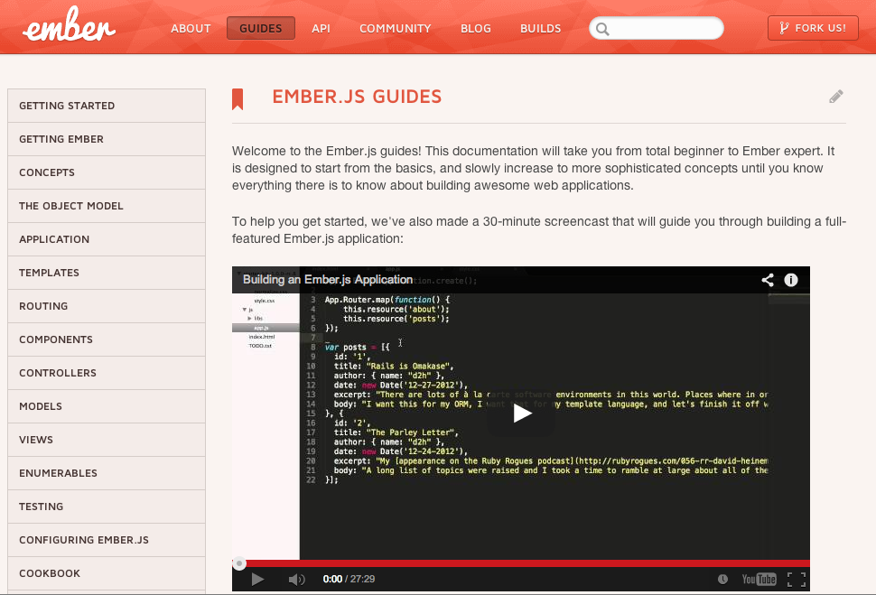

# Ember.js
## @jacobthemyth

---

# What is Ember?

---


## A framework for creating ambitious web applications

---

> Frameworks are designed to nudge you in the right direction.
-- Yehuda & Tom

---

## Most web applications are poorly defined finite state machines.

---

### Ember is a convenient way to define your application's state machine using conventions.

---

# Ember is a state machine
“At any given time, we should be able to answer questions like: Is the user currently logged in? Are they an admin user? What post are they looking at? Is the settings screen open? Are they editing the current post?”

---

## URL
### In Ember, each of the possible states in your application is represented by a URL.

---

# Router
## Defines the allowable states of your application

```coffeescript
App.Router.map ->
  @resource("posts")
```

---

# Routes
## Put the application into the state represented by the URL

---

```coffeescript
App.PostsRoute = Ember.Route.extend
  controllerName: 'posts'

  model: ->
    @store.find('posts')

  setupController: (controller, model) ->
    controller.set("model", model)

  renderTemplate: ->
    postsController = @controllerFor("posts")
    @render "posts",
      into: "application"
      outlet: "main"
      controller: postsController
```

---

# Templates
## Present the current state of the application to the user.

---

    application.hbs
```handlebars
<header>
  <h1>Hay Guyz</h1>
</header>

<main>
  {{outlet}}
</main>

<footer>©{{currentYear}}</footer>
```

---

## Conventions make it easy to do the right thing

---

```coffeescript
App.PostsRoute = Ember.Route.extend
  controllerName: 'posts'

  model: ->
    @store.find('posts')

  setupController: (controller, model) ->
    controller.set("model", model)

  renderTemplate: ->
    postsController = @controllerFor("posts")
    @render "posts",
      into: "application"
      outlet: "main"
      controller: postsController
```

---

```coffeescript
App.PostsRoute = Ember.Route.extend()
```

---

# Controllers
## Represent transient application state

---

```coffeescript
App.PostsController = Ember.ArrayController.extend
  selected: null

  actions:
    select: (post) ->
      @set("selected", post)
```

    posts.hbs

```handlebars
{{#each posts}}
  <div {{action "select" this}}>
    {{body}}
  </div>
{{/each}}
```

---

# Models
## Represent persistent application state

---

```coffeescript
App.Post = DS.Model.extend
  body: DS.attr("string")

  summary: (->
    @get("body").slice(0, 139)
  ).property("body")
```

---

- Promises are first class citizens
- Observers and bindings
- Built in run loop
- Identity map
- HTMLbars
- Preventing and retrying state transitions
- Dependency injection
- Test helpers

---

# Ember is important

---

# Abstraction


---

> Willpower and cognitive processing draw from the same pool of resources.
-- @seriouspony


---

# Web Components
Reusable, element-like widgets that encapsulate HTML, CSS, and JS

```html
<a href="http://emberjs.com">Ember</a>
<a href="#something">Ember</a>
```

---

```html
<div id="slider">
  <input checked="" type="radio" name="slider" id="slide1" selected="false">
  <input type="radio" name="slider" id="slide2" selected="false">
  <input type="radio" name="slider" id="slide3" selected="false">
  <input type="radio" name="slider" id="slide4" selected="false">
  <div id="slides">
    <div id="overflow">
      <div class="inner">
        <article>
          
        </article>
        <article>
          
        </article>
        <article>
          
        </article>
        <article>
          
        </article>
      </div>
    </div>
  </div>
  <label for="slide1"></label>
  <label for="slide2"></label>
  <label for="slide3"></label>
  <label for="slide4"></label>
</div>
```

---


---

```html

  
  
  
  
</img-slider>
```

---

# Components in Angular
Bi-directionally bound, isolate scope, transcluded, element restricted directive.

---

# Components in Ember

    application.hbs
```handlebars
{{img-slider}}
  
  
  
  
{{/img-slider}}
```

---

```coffeescript
$(".img-slider-container").each ->
  App.ImgSliderComponent.create().replaceIn(this)
```

---

# Ember makes it easy to do the right thing.

---

# Ember makes it hard to do the wrong thing.

---

> You have to check out this amazing new tool that lets non-programmers quickly build fully-interactive web apps.
-- @worrydream


---



---

# Questions?
## @jacobthemyth
